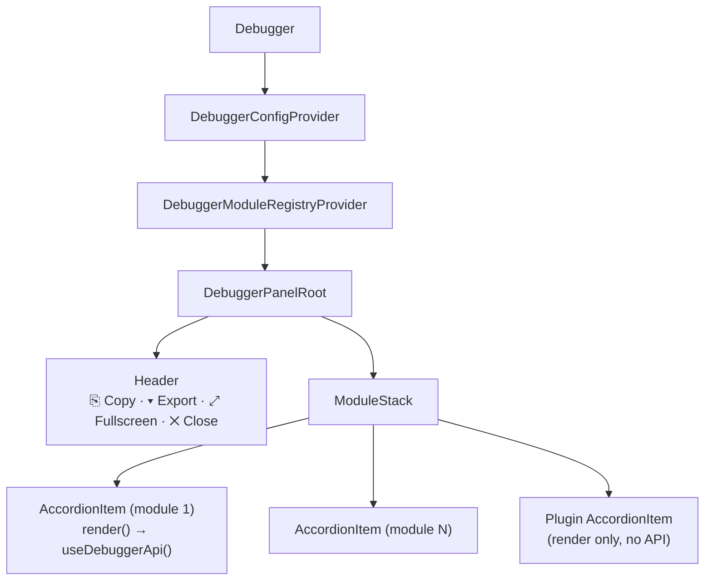
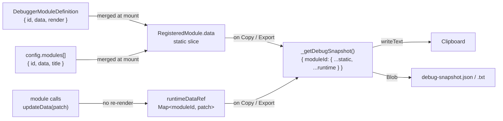
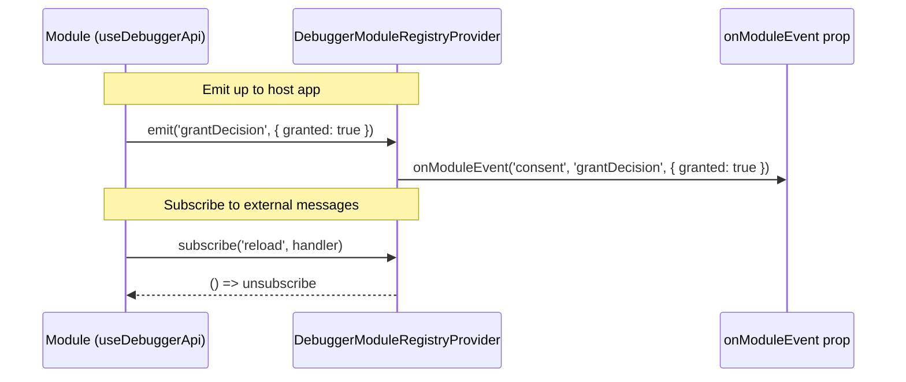

# debugger-pro-plus-3000

A modular, framework-agnostic debugger panel for React applications — distributed as an npm package.

## Install

```bash
npm install debugger-pro-plus-3000
# or
pnpm add debugger-pro-plus-3000
```

React and ReactDOM ≥18 are peer dependencies.

---

## Quick start

### Path A — Plugins (simple render slots, no API)

Drop in any render function as a panel section:

```tsx
import { Debugger } from 'debugger-pro-plus-3000'

function App() {
  return (
    <>
      <YourApp />
      <Debugger
        plugins={[
          {
            id: 'state',
            label: 'App State',
            render: () => <pre>{JSON.stringify(appState, null, 2)}</pre>,
          },
        ]}
      />
    </>
  )
}
```

### Path B — Modules with API (data registration + runtime updates + events)

Use `useDebuggerApi()` inside a module's `render` function to push live data into the debug snapshot:

```tsx
import { Debugger, useDebuggerApi } from 'debugger-pro-plus-3000'

function ConsentStatus() {
  const { updateData } = useDebuggerApi()

  useEffect(() => {
    consentSdk.onDecision((result) => {
      updateData({ granted: result.granted, vendor: result.vendor })
    })
  }, [updateData])

  return <span>Listening for consent decisions…</span>
}

function App() {
  return (
    <Debugger
      modules={[
        {
          id: 'consent',
          title: 'Consent Manager',
          render: () => <ConsentStatus />,
          data: { granted: null, vendor: null }, // initial snapshot values
        },
      ]}
      onModuleEvent={(moduleId, event, payload) => {
        console.log(`[${moduleId}] ${event}`, payload)
      }}
    />
  )
}
```

When a user clicks **⎘ Copy** in the panel header, the full snapshot is copied to clipboard:

```json
{
  "consent": { "granted": true, "vendor": "Sourcepoint" }
}
```

---

## `<Debugger>` props

| Prop | Type | Default | Description |
|---|---|---|---|
| `modules` | `DebuggerModuleDefinition[]` | `[]` | Accordion panels with full API access via `useDebuggerApi()` |
| `plugins` | `DebuggerPlugin[]` | `[]` | Simple render-slot panels (no API) |
| `config` | `DebuggerConfig` | see defaults | Inline config, merged with file-based `config.debugger.js` |
| `defaultOpen` | `boolean` | `false` | Panel open on mount |
| `onModuleEvent` | `(moduleId: string, event: string, payload: unknown) => void` | — | Receive events emitted by modules via `emit()` |

---

## `useDebuggerApi()`

Call inside a module's `render` function. Throws if called outside a module context.

```ts
const { updateData, moduleData, emit, subscribe } = useDebuggerApi()
```

| Return | Type | Description |
|---|---|---|
| `updateData(patch)` | `(Record<string, unknown>) => void` | Shallow-merge runtime data into this module's debug snapshot slice. No re-render — updates are flushed on the next Copy/Export. |
| `moduleData` | `Record<string, unknown>` | Static registration data for this module (initial values from `DebuggerModuleDefinition.data` merged with `config.modules[].data`). Does **not** include runtime patches from `updateData()` — those appear only in the Copy/Export snapshot. |
| `emit(event, payload?)` | `(string, unknown?) => void` | Emit an event up to the `onModuleEvent` handler on `<Debugger>`. |
| `subscribe(event, handler)` | returns `() => void` | Subscribe to events sent to this module from outside. Returns an unsubscribe function. |

---

## Configuration

Configuration can come from a file or inline prop — both are merged (inline wins on conflict).

### File: `config.debugger.js` (auto-loaded at runtime)

```js
// public/config.debugger.js  (or wherever your assets are served)
export default {
  style: {
    primaryColor: '#7c3aed',
  },
  button: {
    position: 'bottomRight', // 'bottomRight' | 'bottomLeft' | 'topRight' | 'topLeft'
    draggable: true,
  },
  panel: {
    title: 'My Debugger',
    style: { width: 400 },
  },
  modules: [
    { id: 'consent', defaultExpanded: true, data: { env: 'production' } },
  ],
}
```

### Inline: `config` prop

```tsx
<Debugger
  config={{
    style: { primaryColor: '#e11d48' },
    panel: { title: 'Debug', style: { width: 360 } },
  }}
  modules={[...]}
/>
```

Load the file manually with `loadDebuggerConfig()` if you need to await it before rendering:

```ts
import { loadDebuggerConfig } from 'debugger-pro-plus-3000'

const config = await loadDebuggerConfig({ src: '/config.debugger.js' })
```

---

## Copy / Export

The panel header contains a split **Copy / Export** button:

| Action | What happens |
|---|---|
| **⎘ Copy** | Copies the full debug snapshot JSON to the clipboard. Shows ✓ for 1.5 s. |
| **▾ → Download .json** | Downloads `debug-snapshot.json` (pretty-printed JSON). |
| **▾ → Download .txt** | Downloads `debug-snapshot.txt` (same content, plain text). |

**Snapshot shape:**

```json
{
  "moduleId": {
    "anyKey": "staticValueFromDefinition",
    "anotherKey": "runtimePatchFromUpdateData"
  }
}
```

Each module's slice is the shallow merge of its static `data` (from `DebuggerModuleDefinition.data` and `config.modules[].data`) with all runtime patches applied via `updateData()`.

---

## Architecture

### Component tree



### Module data flow



### Module event bus



---

## Development

```bash
pnpm install
pnpm dev       # start Vite dev server with live demo
pnpm build     # build library → dist/
pnpm lint      # ESLint (0 warnings policy)
```

---

## License

MIT
