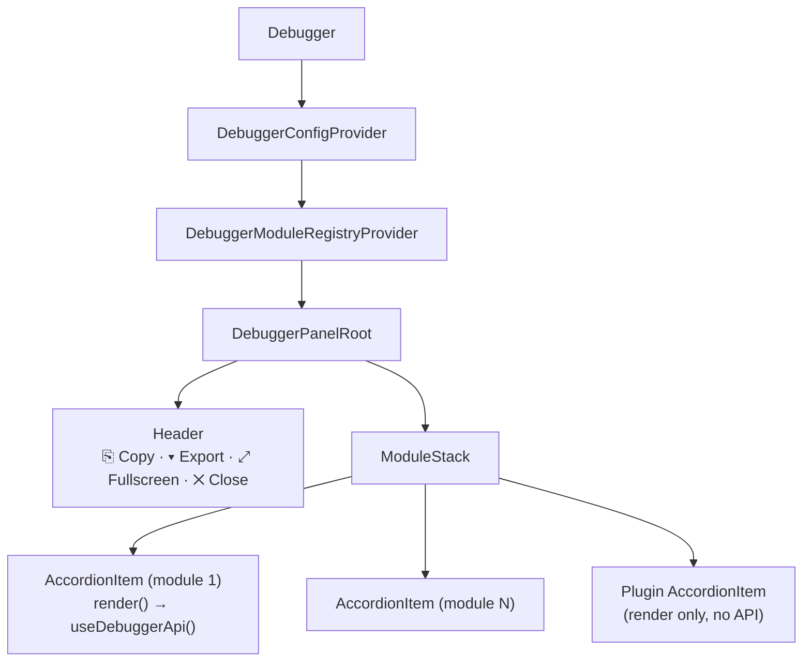
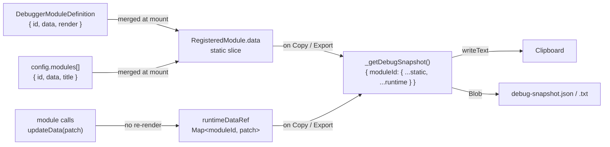
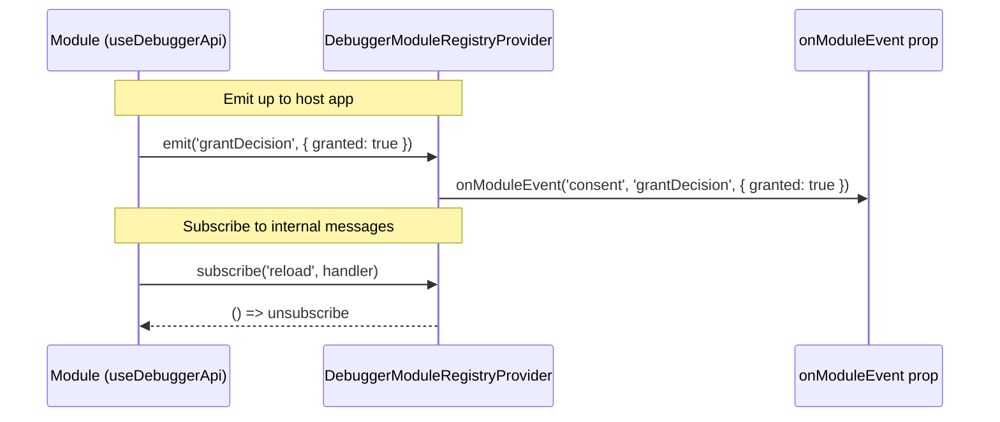

# Architecture

Internal design of `debugger-pro-plus-3000`.

---

## Component tree

---

## Module data flow

`updateData()` writes to a ref — zero re-renders. Runtime patches merge with static data only when the user triggers Copy/Export.

---

## Module event bus

---

## Key design decisions

- **`runtimeDataRef` not state** — runtime patches don't cause re-renders; data is only read on-demand at export time.
- **Split plugin / module model** — plugins are zero-setup render slots; modules opt into the API (`useDebuggerApi`) and data registration.
- **Config merge order** — `DebuggerModuleDefinition.data` < `config.modules[].data` < `useDebuggerApi().updateData()` (last write wins per key).
- **`_getDebugSnapshot` closure** — captures `modules[]` from the last render; runtime ref is read at call time, so the snapshot is always fresh.
