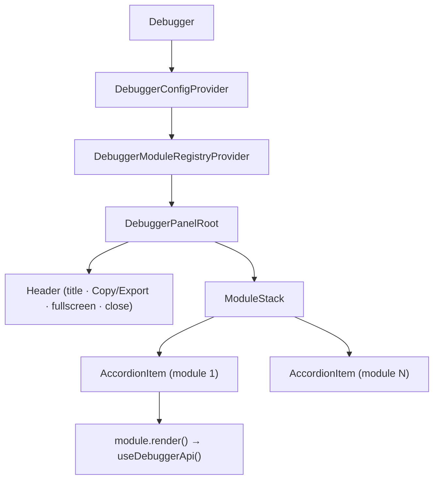
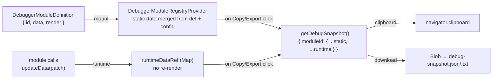
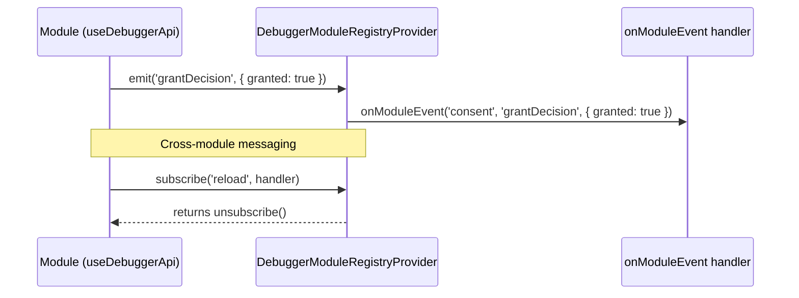

# N05 — Rewrite README with full API docs and architecture diagrams

## Goal

Replace the stale README (written before N03/N04) with accurate, complete documentation covering the current public API, configuration system, module data registration, copy/export feature, and three Mermaid diagrams showing how the library works.

---

## Current README problems

- Props table references non-existent `position` prop (moved to `config`)
- No mention of `modules`, `useDebuggerApi`, `updateData`, `onModuleEvent`
- No mention of `loadDebuggerConfig` / `config.debugger.js`
- No mention of the copy/export header button (N04)
- No architecture or data-flow explanation
- Plugin interface is the only usage pattern shown

---

## What to write

### 1. Header block
- One-line description (keep existing)
- Install (keep, correct)
- Peer deps note (keep)

### 2. Quick start — two paths

**Path A: Plugins (zero-setup render slots)**
```tsx
import { Debugger } from 'debugger-pro-plus-3000'

function App() {
  return (
    <>
      <YourApp />
      <Debugger
        plugins={[{
          id: 'state',
          label: 'App State',
          render: () => <pre>{JSON.stringify(state, null, 2)}</pre>,
        }]}
      />
    </>
  )
}
```

**Path B: Modules with API (data registration + events)**
```tsx
import { Debugger, useDebuggerApi } from 'debugger-pro-plus-3000'

function ConsentStatus() {
  const { updateData } = useDebuggerApi()

  useEffect(() => {
    sdk.onConsent((result) => {
      updateData({ granted: result.granted, vendor: result.vendor })
    })
  }, [updateData])

  return <span>Consent module active</span>
}

function App() {
  return (
    <Debugger
      modules={[{
        id: 'consent',
        title: 'Consent Manager',
        render: () => <ConsentStatus />,
        data: { granted: null },   // initial snapshot data
      }]}
    />
  )
}
```

### 3. `<Debugger>` props table (corrected)

| Prop | Type | Default | Description |
|---|---|---|---|
| `modules` | `DebuggerModuleDefinition[]` | `[]` | Modules with API access (`useDebuggerApi`) |
| `plugins` | `DebuggerPlugin[]` | `[]` | Simple render-slot panels (no API) |
| `config` | `DebuggerConfig` | see defaults | Inline config (merged with file-based config) |
| `defaultOpen` | `boolean` | `false` | Panel open on mount |
| `onModuleEvent` | `(moduleId, event, payload) => void` | — | Receive events emitted by modules |

### 4. `useDebuggerApi()` reference

| Return | Type | Description |
|---|---|---|
| `updateData(patch)` | `(Record<string, unknown>) => void` | Merge runtime data into this module's debug snapshot slice |
| `moduleData` | `Record<string, unknown>` | Current snapshot data for this module (read) |
| `emit(event, payload?)` | `(string, unknown?) => void` | Emit event to `onModuleEvent` on `<Debugger>` |
| `subscribe(event, handler)` | returns unsubscribe fn | Listen for events sent to this module |

### 5. Configuration

```ts
// config.debugger.js (auto-loaded)
export default {
  style: { primaryColor: '#7c3aed' },
  button: { position: 'bottomRight', draggable: true },
  panel: { title: 'My Debugger', style: { width: 380 } },
  modules: [
    { id: 'consent', defaultExpanded: true, data: { env: 'prod' } }
  ]
}
```

Or inline via `<Debugger config={...} />`. File config is merged with inline config.

### 6. Copy / Export (N04)

Explain the header button:
- `⎘ Copy` — copies the full debug snapshot JSON to clipboard
- `▾` dropdown — download as `debug-snapshot.json` or `debug-snapshot.txt`
- Snapshot shape: `{ [moduleId]: { ...registeredData, ...runtimePatches } }`

### 7. Architecture diagrams (Mermaid — GitHub renders natively)

**Diagram 1: Component tree**


**Diagram 2: Module data flow**


**Diagram 3: Module event bus**


### 8. Development section (keep existing, just verify commands)

---

## Out of scope

- Changelog / version history
- Contributing guide
- CI/CD badges (no CI set up)
